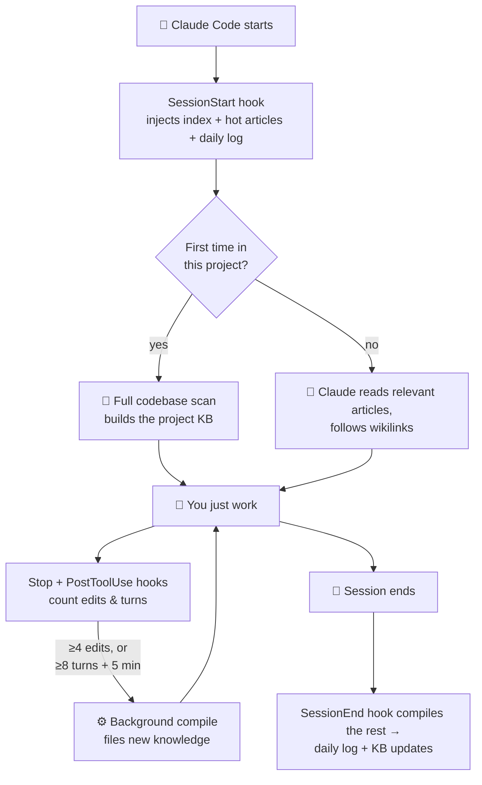

<div align="center">

# 🧠 Engram

### Give Claude Code a memory that never forgets

[](LICENSE)
[](https://www.python.org/downloads/)
[](#-quick-start)
[](https://claude.ai/code)
[](https://obsidian.md)
[](#-contributing)

*An **engram** is the physical trace a memory leaves in the brain.<br/>
This is the digital equivalent — a persistent, compounding knowledge base<br/>
that grows with every Claude Code session, across every project.*

**No API key · No vector database · No embeddings · Just markdown**

</div>

---

## 😩 The Problem

Claude Code is brilliant *inside* a session. Then you close it, and everything is gone:

- 🔁 You re-explain your architecture — again
- 🔁 You re-describe your patterns and conventions — again
- 🔁 You rediscover the same bug you fixed three weeks ago — again
- 🔁 20 minutes of context-building before any real work happens

The more you use Claude, the more you repeat yourself.

## 💡 The Solution

Engram builds a **persistent wiki** — plain Obsidian-compatible markdown — that Claude maintains automatically:

1. 📂 Open Claude Code in any directory → Engram detects the project
2. 🧠 Relevant knowledge is injected into Claude's context before your first message
3. ✍️ As you work, background processes file new decisions, patterns, and fixes into the wiki
4. 🔗 Everything is cross-linked and available in every future session

First time in a project? Claude scans the codebase and builds the knowledge base itself. Every session after that, it just *knows*.

```text
You:    "why did we switch the auth to edge middleware?"
Claude: reads projects/my-app/auth-patterns.md → answers with the decision,
        the date, and the gotcha that motivated it. Zero re-explaining.
```

---

## ✨ Features

| | Feature | What it means |
|---|---------|---------------|
| 🪝 | **Fully automatic** | Four Claude Code hooks capture knowledge during and after every session — you never run a command |
| 🎯 | **Project-aware** | Detects the project from the git remote (or folder), loads only what's relevant |
| 🧮 | **Token-efficient** | ~3–5k tokens injected per session, regardless of KB size; deeper articles load on demand |
| 🔄 | **Mid-session compiles** | After ≥4 file edits, or ≥8 turns + 5 minutes, a background compile files new knowledge with a rolling watermark — long sessions don't lose their tail |
| 🔒 | **Private & local** | Everything stays on your machine; the wiki and logs are gitignored |
| 🗝️ | **No API key** | Background compiles run headless `claude -p` under your existing Claude Code login, tools scoped to read/write only |
| 💜 | **Obsidian-native** | Open `knowledge/` as a vault: graph view, backlinks, Dataview-ready frontmatter |
| 🩺 | **Self-maintaining** | A free structural linter runs weekly; a `/garden` command compacts and de-duplicates articles |
| 🌍 | **Not just for code** | Research, writing, business, personal projects — the KB adapts to whatever is in the folder |

---

## 🚀 Quick Start

```bash
git clone https://github.com/yassine-eluharani/engram.git
cd engram

./install.sh         # macOS / Linux
python install.py    # Windows (PowerShell) — works on all platforms
```

Restart Claude Code. That's it — the next session in any project starts building memory.

<details>
<summary><b>📋 Requirements</b></summary>

| Requirement | Version | Notes |
|---|---|---|
| [Claude Code](https://claude.ai/code) | Latest | The CLI tool by Anthropic |
| [uv](https://docs.astral.sh/uv/) | Any | Fast Python package manager |
| Python | 3.12+ | Managed by uv |
| [Obsidian](https://obsidian.md) | Any | Optional, for browsing the KB |

**No `ANTHROPIC_API_KEY` required.** Claude Code itself is the LLM — it reads and writes the wiki directly during sessions, and background compiles reuse your existing login.

</details>

<details>
<summary><b>🔧 Custom install directory / manual install</b></summary>

### Custom directory

```bash
./install.sh --install-dir /path/to/your/preferred/location
```

### Manual installation

**1.** Copy the repo: `cp -r engram ~/.claude/engram`

**2.** Install dependencies: `uv sync --directory ~/.claude/engram`

**3.** Add the four hooks to `~/.claude/settings.json`:

```json
{
  "hooks": {
    "SessionStart": [
      { "matcher": "", "hooks": [{ "type": "command", "timeout": 15,
        "command": "uv run --directory ~/.claude/engram python ~/.claude/engram/hooks/session-start.py" }] }
    ],
    "SessionEnd": [
      { "matcher": "", "hooks": [{ "type": "command", "timeout": 10,
        "command": "uv run --directory ~/.claude/engram python ~/.claude/engram/hooks/session-end.py" }] }
    ],
    "Stop": [
      { "matcher": "", "hooks": [{ "type": "command", "timeout": 10,
        "command": "uv run --directory ~/.claude/engram python ~/.claude/engram/hooks/stop.py" }] }
    ],
    "PostToolUse": [
      { "matcher": "Write|Edit|NotebookEdit", "hooks": [{ "type": "command", "timeout": 5,
        "command": "uv run --directory ~/.claude/engram python ~/.claude/engram/hooks/post-tool-use.py" }] }
    ]
  }
}
```

**4.** Append the contents of this repo's `CLAUDE.md` to your `~/.claude/CLAUDE.md`

**5.** Restart Claude Code

</details>

---

## 🔍 How It Works



### The three layers

| Layer | What | Owned by |
|-------|------|----------|
| 📁 **Raw source** | Your codebase, documents, notes | You — Claude reads, never modifies |
| 📚 **The wiki** | `knowledge/` — one markdown file per concept, wikilinked | Claude — creates, updates, cross-references |
| 📜 **The schema** | `AGENTS.md` + `CLAUDE.md` conventions | You — defines structure and behavior |

The key difference from RAG: **the wiki is compiled once and kept current**, not re-derived on every query. At personal scale (50–500 articles), an index the LLM can read beats vector similarity — no embeddings to sync, no plausible-but-wrong chunks, and you can `grep` your own memory.

### What gets injected each session (~3–5k tokens)

- 🗂️ **Global index** — current project's rows in full, other projects collapsed to name + count
- 📄 **Project article listing** — titles and first lines
- 🔥 **2 hottest articles** — full content of the most recently updated ones
- 📅 **Daily log tail** — the last 20 lines of today's activity

Claude reads anything deeper on demand with the Read tool, following `[[wikilinks]]` between articles.

### What the knowledge looks like

```markdown
---
title: "Auth Patterns"
project: "my-saas-app"
tags: [auth, supabase, rls]
created: 2026-04-16
updated: 2026-07-12
---

# Auth Patterns

## Key Points
- JWT tokens are verified at the edge via middleware
- RLS policies handle row-level access — never filter in application code

## Related
- [[projects/my-saas-app/overview]] — project context
- [[projects/my-saas-app/database]] — RLS policy definitions
```

Point Obsidian at `knowledge/` and you get graph view, backlinks, and full-text search over everything Claude remembers.

### Not just for code

| Project type | What gets filed |
|---|---|
| 💻 Software | Architecture, patterns, API design, gotchas, decisions |
| 🔬 Research | Thesis, sources, open questions, key concepts |
| ✍️ Writing | Outline, characters, themes, style guide |
| 📈 Business | Goals, decisions, stakeholders, roadmap |
| 🏠 Personal | Goals, context, history, next steps |

---

## 🧰 Usage

Day to day: **nothing**. Open Claude Code, work, close it. Engram runs in the hooks.

When you want to be explicit:

```text
"Update the KB with what we just decided"
"Save this pattern for next time"
"What do you know about our auth system?"
"Compile today's session into the KB"
```

### `/garden` — keep the KB healthy

Background compiles only ever *add*. Occasionally compact a project — merge duplicate bullets, drop resolved or contradicted claims, fix broken links:

```text
/garden              # gardens the current project
/garden my-app       # gardens a specific project
```

Or from the terminal: `uv run --directory ~/.claude/engram python scripts/garden.py <slug>`

### Health checks

A structural linter (broken links, orphan pages, stale/sparse articles, missing backlinks) **runs automatically once a week** — free, no LLM calls. Reports land in `reports/`, with a one-line summary in `auto-updates.log`. Run it manually:

```bash
uv run --directory ~/.claude/engram python scripts/lint.py --structural-only
```

---

## 🏗️ Architecture

```text
engram/
├── hooks/
│   ├── session-start.py     # Injects project-aware KB context at session start
│   ├── session-end.py       # Compiles remaining turns into the KB + daily log
│   ├── stop.py              # Mid-session compile trigger (edit/turn thresholds)
│   ├── post-tool-use.py     # Edit counter for the mid-session trigger
│   └── shared.py            # Session state, compile lock, project detection
├── scripts/
│   ├── lint.py              # KB health checks (structural checks are free)
│   ├── garden.py            # Per-project KB compaction pass
│   ├── config.py / utils.py # Path constants + shared helpers
├── commands/
│   └── garden.md            # The /garden slash command (installed globally)
├── knowledge/               # 📚 The wiki — point Obsidian here
│   ├── index.md             # Master catalog — every article, one-line summary
│   ├── log.md               # Append-only operation log
│   ├── concepts/            # Global, cross-project knowledge
│   ├── projects/<slug>/     # One folder per project
│   └── qa/                  # Filed Q&A
├── daily/                   # Raw session logs — auto-populated by hooks
├── AGENTS.md                # KB schema and article format reference
├── CLAUDE.md                # Instructions for Claude
├── install.sh               # One-command installer (macOS/Linux)
└── install.py               # Cross-platform installer (Windows-friendly)
```

Robustness details, for the curious: per-session state files (concurrent sessions can't clobber each other), a 3-minute compile lock (concurrent compiles serialize), a rolling watermark (nothing is compiled twice), recursion guards (background compiles can't trigger themselves), and background compiles scoped to read/write tools only — no shell access.

---

## ⚙️ Configuration

| Knob | Where | Default |
|------|-------|---------|
| Injection budget | `hooks/session-start.py` → `MAX_CONTEXT_CHARS` | `18_000` chars |
| Hot articles loaded in full | `hooks/session-start.py` → `HOT_ARTICLES` | `2` |
| Mid-session compile: edits | `hooks/stop.py` → `EDITS_THRESHOLD` | `4` |
| Mid-session compile: turns + time | `hooks/stop.py` → `TURNS_THRESHOLD` / `TIME_THRESHOLD_MINUTES` | `8` / `5` |
| Compile model | env `ENGRAM_COMPILE_MODEL` | `claude-sonnet-4-6` |
| Project detection | `hooks/shared.py` → `detect_project()` | git remote → folder name |

```bash
# example: ~3x cheaper background compiles
export ENGRAM_COMPILE_MODEL=claude-haiku-4-5-20251001
```

---

## 🔒 Privacy

- ✅ Everything stays local on your machine
- ✅ No data sent to any external service beyond your normal Claude Code usage
- ✅ No API key required
- ✅ `daily/` and `knowledge/` are gitignored — your memory is never committed
- ✅ The repo you clone contains only the system, never anyone's knowledge

---

## 💭 Inspiration

Engram draws on [Andrej Karpathy's LLM Knowledge Base](https://gist.github.com/karpathy/442a6bf555914893e9891c11519de94f) pattern and Vannevar Bush's [Memex](https://en.wikipedia.org/wiki/Memex) (1945) — a personal, curated knowledge store with associative trails between documents.

> *"The human's job is to curate sources, direct the analysis, ask good questions, and think about what it all means. The LLM's job is everything else."*

---

## 🤝 Contributing

Contributions welcome! Directions worth exploring:

- 🪟 **Windows field reports** — native support is implemented (`install.py`, detached spawns, CLI resolution) but needs real-world testing
- 🔀 **Project aliases** — map multiple directories to one project
- 🔍 **KB search CLI** — query the KB from the terminal
- 🔌 **Obsidian plugin** — surface KB gaps, trigger updates from the vault
- 📤 **Export formats** — reports, docs, or decks generated from articles

Please open an issue before starting significant work.

## 📜 License

[MIT](LICENSE)

---

<div align="center">

**If Engram saves you from re-explaining your project one more time, consider a ⭐**

*Built for people who never want to say "as I mentioned last session" again.*

</div>
